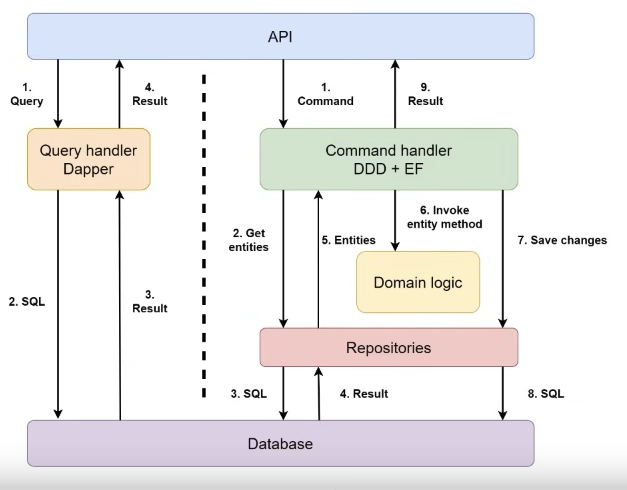

+++
draft = "true"
title = "CQRS"
weight = 50
+++

> [!ressource] Ressource
> [How to Implement the CQRS Pattern in Clean Architecture (from scratch)](https://youtu.be/85YbMEb1qkQ?list=PLYpjLpq5ZDGv370qMB4PLF-PlGdBhP0PA)

