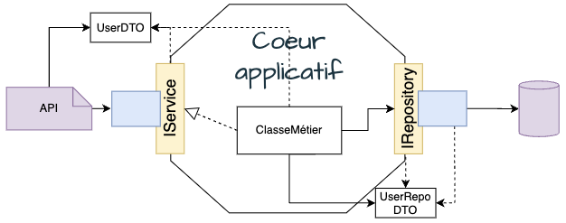

+++
draft = "true"
title = "Architecture Hexagonale"
weight = 10
+++

> [!ressource] Ressources
> - [Hexagonal architecture - original post](https://alistair.cockburn.us/hexagonal-architecture/)
> - [Hexagonal architecture - ensemble d'articles détaillés](https://jmgarridopaz.github.io/content/articles.html)
> - [Architecture Hexagonale : le guide pratique pour une clean architecture - FR](https://beyondxscratch.com/fr/2018/09/11/architecture-hexagonale-le-guide-pratique-pour-une-clean-architecture/)
> - [https://hexagonalarchitecture.org/](https://hexagonalarchitecture.org/)
> - [Hexagonal Architecture ( Ports & Adapters )The 2023 version](https://alistaircockburn.com/Hexagonal%20Budapest%2023-05-18.pdf)
> - [Hexagonal Architecture Example: digging a Spring Boot implementation](https://beyondxscratch.com/2020/08/23/hexagonal-architecture-example-digging-a-spring-boot-implementation/)

Allow an application to equally be driven by users, programs, automated test or batch scripts, and to be developed and tested in isolation from its eventual run-time devices and databases.

> [!danger] Définition
>  Le coeur de l'hexagone ne dépend de rien (ni d'Hibernate, ni de Spring).

C'est la caractéristique principale d'une architecture en Hexagonale


## 1. Le coeur applicatif

Le coeur applicatif contient l'ensemble de la logique métier est totalement indépendant de la _présentation_ ou de la _persistance_.


## 2. Communication sortante (Driven Port)

{}
If we want to follow the [Single Responsibility Principle](), then we would have a lot of ports, _each one for a use case_.
{}

> A driven port is an interface for a functionality, needed by the application for implementing the business logic. Such functionality is provided by a driven actor. So driven ports are the SPI (Service Provider Interface) required by the application. A driven port would be like a Required Interface.

Néanmoins notre application a besoin de communiquer avec plusieurs librairie : base de données, email, etc ...
Au lieu d'avoir une dépendance directe avec ce module tier, on va utiliser un port/adaptateur.


- Le port permet aux classes métiers de communiquer avec l'extérieur sans connaitre l'implémentation de la base de données. Tout passe au travers d'un contrat.
- L'adaptateur est la logique qui permet d'effectuer l'écriture en base de donnée.
- Par conséquent, les données envoyées par les classes métier sont converties par l'adaptateur en une donnée lisible pour la base de données.


> [!note] Note
>  Et quelque soit les changements effectués, seul l'adaptateur changera. Le coeur applicatif, lui, reste inchangé. On découple la logique interne avec l'utilisation de modules tiers.

## 3. Communication entrante (Driver Port)

> Driver Ports offer the application functionality to drivers of the outside world. Thus, driver ports are said to be the use case boundary of the application. They are the API of the application.

On peut faire de même pour les communications entrantes, par exemple lorsque notre logique métier est appelée par une API.
Pour ce faire, on va définir un contrat d'échange où on préciser comment on souhaite recevoir les données (interface + DTO de requête) et quelles données nous renvoyons (DTO de réponse). Par conséquent, quelque soit l'appelant l'input et l'ouput seront toujours les mêmes.

```java
interface IService {
    /* L'appelant devra fournir un RequestDTO et obtiendra un ResponseDTO */
    ResponseDTO methode(RequestDTO requestDTO);
}
```



> Nous n'avons plus besoin de passer du temps à déterminer à quoi devrait ressembler tel ou tel DTO, et quelles sont les données dont le frontend besoin. Nous pouvons plutôt nous concentrer sur les données que nous voulons exposer au frontend.

Dans notre cas les données qu'on souhaitera exposer au frontend seront les attributs contenus dans `ResponseDTO`

## Conclusion

Comme nous l'avons vu, les éléments de l'architecture sont :

- **L'Hexagone** qui réprésente l'application

  - Driver Ports (à droite) ==> API offerte par l'application
  - Driven Ports (à gauche) ==> SPI requis par l'application

- **Acteurs** : les éléments (e.g. humain, cli, test ...) qui interagissent avec l'application

  - Drivers Actors ==> utilisateurs de l'application (humains ou dispositifs matériels/logiciels)
  - Driven Actors ==> fournissent les services requis par l'application (e.g. base de données)

- **Adaptateurs** : adaptent une technologie spécifique à l'application
  - Driver Adapters ==> _utilisent_ les drivers ports
  - Driven Adapters ==> _implémentent_ en œuvre les driven ports
