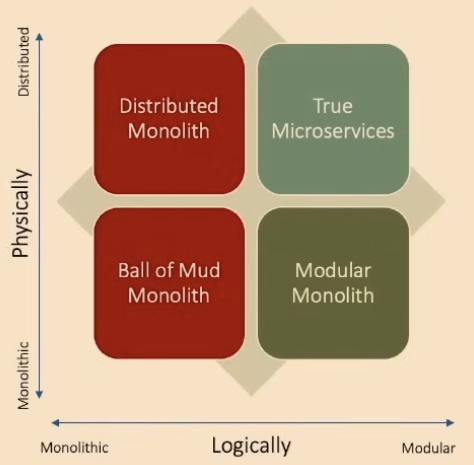

+++
draft = "true"
title = "Modular Monolithique"
weight = 10
+++

> [!ressource] Ressources
> - [MUST READ - Modular Monolith: A Primer](https://www.kamilgrzybek.com/blog/posts/modular-monolith-primer)
> - [MUST READ - Modular Monolith: Série d'articles](https://www.kamilgrzybek.com/blog/categories/modular-monolith)

> - [Modular Monolith by microservices.io](https://microservices.io/post/architecture/2023/07/31/how-modular-can-your-monolith-go-part-1.html)

> - [Lesson 159 - Modular Monolith Architecture](https://youtu.be/ikuu3QIuJuc)
> - [Modular Monoliths • Simon Brown • GOTO 2018](https://youtu.be/5OjqD-ow8GE)
> - [Are Modular Monoliths a Winner?](https://hexmaster.nl/posts/are-modular-monoliths-a-winner/)

Intermédiaire entre une architecture monolithe et une architecture microservice, la *Modular Monolithe* (ou Modulithe) doit être un intermédiaire à considérer.

