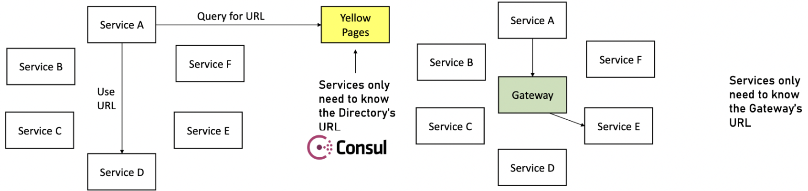

+++
draft = "true"
title = "Communication"
weight = 30
+++

Le choix du bon style de communication aide les équipes à maintenir les services découplés tout en les coordonnant de manière appropriée.

De manière générale, il existe trois patterns pour gérer la communication entre services

## 1-to-1 Synchrone

Elle est utilisée quand un process a besoin des réponses d'un autre process pour continuer.

L'avantage de cette solution c'est qu'elle est facile à implémenter et nous obtenons une réponse immédiatement mais en contre partie nous pouvons avoir de mauvaises performances car nous sommes dépendants des performances des services appelés.

Par conséquent, il faut limiter la communication synchrone uniquement lorsque nous avons absolument besoin de la réponse d'un autre service

### Problème des connexions directes

Si tous nos services sont reliés par des connexions directes alors si nous modifions le service D (e.g. son url) alors tous les autres services vont être impactés et devront être mis à jour. Pour résoudre ce problème il existe deux approches :

- Découverte de service (_yellow pages_) : lorsqu'un service souhaite contacter un autre service il va demander l'url à l'annuaire

- Gateway : le service va contacter la gateway qui elle va contacter le service requis. L'avantage de la gateway c'est qu'en plus de gérer les urls elle peut offrir d'autres services : monitoring, authentification, validation, etc ...

## 1-to-1 Asynchrone

Lorsqu'un service appelle un autre service mais n'a pas besoin de la réponse; l'appelant continue son exécution.

On l'utilise principalement lorsque le premier service souhaite passer un message à l'autre service. Pour ce faire le message passe au travers d'une Queue où les deux services sont abonnés

Par exemple le service Commande envoie un message au service Payement pour notifier de l'achat mais ne se préoccupe pas de savoir ce qu'il se passe ensuite.

Le principal avantage est la performance, mais cette approche nécessite plus de configuration et la gestion des erreurs est plus compliquée.

## Publisher-Subscriber / Event Driven

Lorsqu'un service souhaite notifier un autre service. La différence avec 1-to-1 Asynchrone c'est que l'émetteur ne connaît pas le nombre de récepteurs.

Comme pour l'approche asynchrone, le récepteur est responsable du traitement de message (il peut également l'ignorer). Par exemple si la commande est annulée alors le service de payment sera notifié et effectuera un remboursement.

