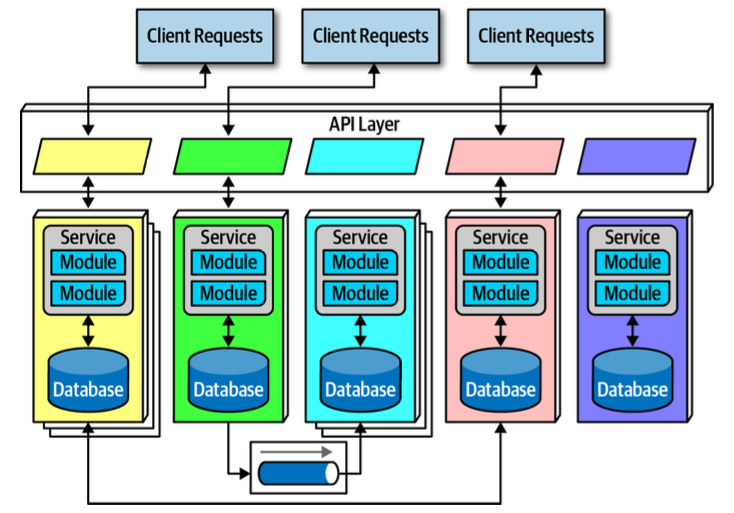

+++
draft = "true"
title = "Microservices"
weight = 40
alwaysopen = false
+++

> [!ressource] Ressources
> - [https://martinfowler.com/microservices/](https://martinfowler.com/microservices/)
> - [https://microservices.io/patterns/](https://microservices.io/patterns/)
> - [https://learn.microsoft.com/en-us/azure/architecture/guide/architecture-styles/microservices](https://learn.microsoft.com/en-us/azure/architecture/guide/architecture-styles/microservices)

Créée en 2011 et popularisée par Martin Fowler et James Lewis dans [leur article "Microservice"](https://martinfowler.com/articles/microservices.html)
elle a qui a connu une popularité croissante et rapide au cours des dernières années.

Elle prend son inspiration du Domain-Driven Design (DDD), une approche conceptuelle et méthodologique du développement logiciel qui met l'accent sur la modélisation du domaine métier. Notament de la notion centrale de _Bounded Context_.

> [!danger] Définition
>  Des services qui communiquent entres eux via des *well-defined* interfaces.

Le style architectural des microservices est une approche qui consiste à développer une application unique sous la forme d'une suite de petits services, chacun s'exécutant dans son propre processus et communiquant à l'aide de mécanismes légers, souvent une API HTTP.

