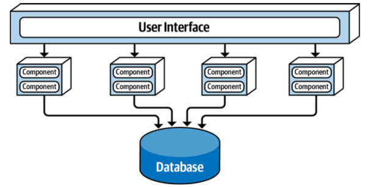

+++
draft = "true"
title = "Service-Based"
weight = 20
alwaysopen = false
+++

La *Service Based Architecture* est essentielle à comprendre. Elle s'inscrit comme bon compromis entre les [architectures monolithiques]({}) et l'[architecture microservices]({}). De nombreux concepts de l'architecture *Service Based* sont repris dans le chapitre dédié aux microservices. 

> [!danger] Définition
>  L'essentiel est de comprendre les [différences]({}) entre l'architecture service-based et l'architecture microservices.

## Introduction par Mark Richard
Pour en remettre une couche sur l'importance de considérer cette architecture, je vous copie/colle l'introduction de cette architecture par Mark Richard
> Service-based architecture is a hybrid of the microservices architecture style and is considered one of the most pragmatic architecture styles, mostly due to its architec‐ tural flexibility. Although service-based architecture is a distributed architecture, it doesn’t have the same level of complexity and cost as other distributed architectures, such as microservices or event-driven architecture, making it a very popular choice for many business-related applications.

## Composition
Cette architecture se compose :
- de plusieurs services qui sont des domaines indépendants déployés en tant qu'unités logicielles distinctes.
- d'une base de données centrale qui est partagée avec l'ensemble des services
- les services sont accessibles via un protocole d'accès à distance (e.g. REST)

Les services représentent le coeur applicatif, étant donné que nous n'avons qu'une seule base de données nous limiterons le nombre de service de 4 à 12. Le principal problème viendra lorsqu'on va souhaiter changer l'architecture de notre base de données, l'ensemble des services seront impactés. Une solution consiste à faire du [Database Partitioning]({})
