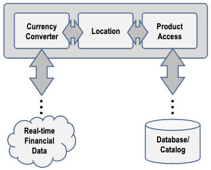
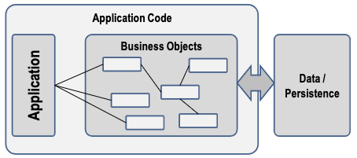
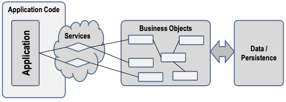
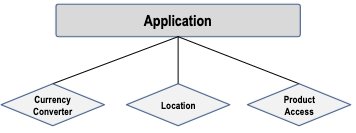

+++
draft = "true"
title = "Composition"
weight = 40
+++

> [!ressource] Ressources
> - [https://www.comp.nus.edu.sg/~seer/book/2e/Ch10.%20Service%20Oriented%20Architecture.pdf](https://www.comp.nus.edu.sg/~seer/book/2e/Ch10.%20Service%20Oriented%20Architecture.pdf)

## Motivation

Prenons l'exemple d'une application de catalogue capable de récupérer des informations sur les produits à partir d'une base de données. Cette application peut être utilisée par un service qui a besoin de se tenir informer des derniers produits et des prix proposés par l'entreprise. De plus, comme il s'agit d'une organisation multinationale, la base de données peut trouver dans un autre pays. Par conséquent, la conversion de la monnaie locale doit également être effectuée en fonction du lieu d'exécution de l'application.

### Le problème

Cette architecture pose plusieurs problèmes :

- L'interopérabilité : l'application doit à la fois obtenir les données financières en temps réel pour effectuer la conversion de la monnaie locale et à la fois récupérer les informations du produit en base de données. Comme les deux systèmes sont probablement différents, le développeur doit s'occuper de l'interfaçage.
- Redondance : étant une grosse organisation il y a des chances que le composant pour l'interfaçage est déjà été développé mais le développeur l'ignore. De plus, les différents départements de l'organisation n'utilisent peut-être pas la même technologie pour développer leur application, ce qui accroît la difficulté du partage des composants.
- Isoler la couche métier : La logique métier est fortement couplé à la base de données. Donc quand le schéma de la base de données va évoluer l'application devra également être mise à jour. Donc retesté et redéployé.

Une application _non-SOA_ ressemble à l'architecture suivante

## SOA

Avec la SOA, la logique métier est décomposée en services bien définis et réutilisables qui seront exposés pour que tout le monde puisse les utiliser. L'application n'a plus qu'à les consommer. Il n'est plus nécessaire de parcourir une hiérarchie d'objets complexe et le développeur n'a plus besoin de comprendre la logique de chaque domaine.

> [!danger] Définition
>  Les services font office d'abstraction.

L'architecture orientée services expose les fonctionnalités de l'entreprise sous la forme de _services_ destinés à être consommés par les applications. Pour notre exemple nous aurions les services suivants

