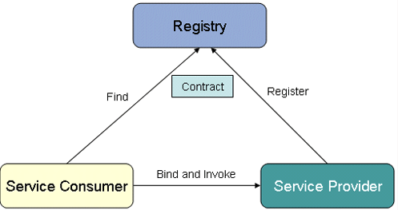

+++
draft = "true"
title = "Service-Oriented (SOA)"
weight = 10
alwaysopen = false
+++

> [!ressource] Ressources
> - [Service-Oriented Architecture - DOI:10.4018/978-1-59140-799-7.ch160](https://www.researchgate.net/publication/292551195_Service-Oriented_Architecture)
> - [Service-Oriented Architecture (SOA) and Web Services - Oracle](https://www.oracle.com/technical-resources/articles/javase/soa.html)

## Pourquoi SOA

Dans le chapitre dédié aux [architectures monolithiques]({}) nous évoquions le fait que ces dernières ne peuvent rien partager au monde extérieur. L'architecture SOA vient répondre à cette problématique (via une API). Les services vont donc exposer des _métadata_ pour décrire leurs fonctionnalités (SOAP ou WSDL)

Cette vision est apparue dans les années 1990 avec la concurrence des marchés les entreprises devaient devenir de plus en plus compétitives. Il fallait pouvoir intégrer facilement de nouveaux métiers dans les SI des entreprises. De plus avec l'approche monolithique si l'un des éléments de l'application ne fonctionnait pas correctement, il fallait mettre hors ligne l'application entière pour résoudre le problème avant de déployer une autre version.

SOA fournit un framework permettant d'avoir :

- Temps de réponse rapide aux clients, aux fournisseurs et aux partenaires commerciaux ;
- Redéfinition dynamique des opérations en fonction de l'évolution de l'environnement commercial ;
- Découverte automatique des interfaces et des implémentations de services.

Pour ce faire, une architecture SOA doit répondre au caractéristiques suivantes :

- n'a pas de langage spécifique de transport et de système d'exploitation. Doit être pris en charge par des normes ouvertes (SOAP, WSDL, etc ...).
- aucune activité humaine n'est impliquée lors de l'exécution
- application peut être divisée en "fragments de processus d'affaires" (i.e. services). Où chaque service expose une interface bien définie accessible via le réseau.

> Les applications SOA sont donc beaucoup plus souples, plus faciles à intégrer et plus simples à maintenir que les applications "monolithiques" classiques.

## Web Service

{}
L'architecture SOA et les services web sont deux choses différentes, mais les _services web_ sont le moyen privilégié de réaliser l'architecture SOA sur la base de normes.
{}

Les services web sont des systèmes logiciels conçus pour soutenir l'interopérabilité de machine-à-machine sur un réseau. Cette interopérabilité est assurée par un ensemble de normes ouvertes basées sur XML, telles que WSDL (Web Services Description Language), SOAP (Simple Object Access Protocol) et UDDI (Universal Description, Discovery, and Integration). Ces normes fournissent une approche commune pour la définition, la publication et l'utilisation des services web.

La figure du dessus montre la mise en œuvre de l'architecture SOA avec les services Web. [^1]

1. Le fournisseur (service gestion client) publie son contrat d'interface sous la forme d'un document WSDL dans l'UDDI
2. Les demandeurs de services localisent les services à l'aide d'un registre de services, UDDI. Le serveur UDDI contient la base de données des descriptions de services et les fournit à l'application du demandeur de service.
3. Le demandeur (service mobile) utilise le document WSDL pour comprendre le contrat d'interface avec le service web. Grâce aux informations contenues dans le document WSDL le demandeur comprendra comment accéder au service, quelles sont ses méthodes et quels sont les paramètres à envoyer, etc ...

> Les services web simplifient les processus commerciaux sans l'implication de l'homme.

Par exemple, lorsqu'un employé réserve un vol, il indique l'heure de vol souhaitée. Ensuite, un membre du personnel naviguera sur le serveur web de la compagnie aérienne et réservera le billet, car il n'y a pas d'intégration entre les services web et le système de réservation de vol de la compagnie aérienne. Grâce au service web, les deux services sont intégrés et le processus est automatisé

[^1]: Nous reviendrons sur ce schema et le fonctionnement dans les parties suivantes
