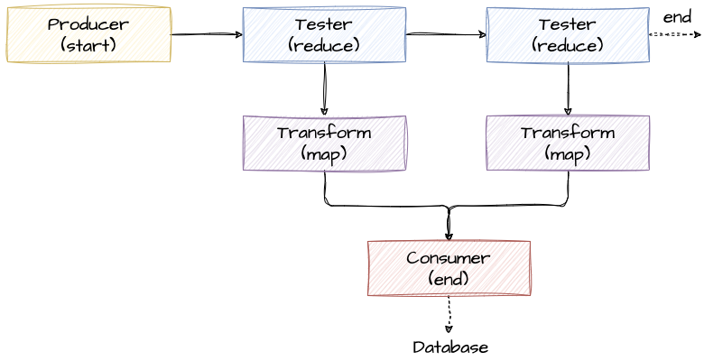

+++
draft = "true"
title = "Pipeline"
weight = 30
alwaysopen = false
+++

L'architecture Pipeline (ou Pipe-Filter) permet de traiter des données de manière séquentielle grâce à une série d'étapes. Chaque étape reçoit la sortie de l'étape précédente, le traite et le passe à l'étape suivante.

## Composition
Cette architecture est composée de *pipes* et de *filtres* successifs. 

### Pipes
Les *pipes* servent de conduits pour le flux de données entre les filtres. Chaque *pipe* est généralement unidirectionnel et la connexion est point-à-point

### Filtres
> [!danger] Définition
>  Les filtres sont des composants **autonomes (self-contained)**, **indépendants** les uns des autres et **sans état (stateless)**[^1]
>  
>  [^1]: Stateless signifie que le composant ne stocke pas de données et ne fait référence à aucune transaction passée.

Les filtres sont des composants de traitement individuels chargés d'effectuer des tâches spécifiques sur les données. Chaque filtre possède des interfaces d'entrée et de sortie bien définies. Les filtres sont conçus pour être modulaires et réutilisables, ce qui facilite l'ajout, la modification ou la suppression d'étapes dans le traitement sans affecter l'ensemble du système.

Il existe 4 types de filtres :
- *Producteur* : Le point de départ d'un processus. Un producteur n'est que sortant et ne reçoit aucune donnée en entrée.
- *Transformateur* : accepte des données en entrée, effectue une transformation sur tout ou partie des données et les envoie. Il est équivalent à la fonction `map` dans la programmation fonctionnelle.
- *Testeur* : accepte des données en entrée, teste un ou plusieurs critères, puis produit éventuellement une sortie basée sur le test. C'est l'équivalent de la fonction `reduce` en programmation fonctionnelle.
- *Consommateur* : c'est le point de terminaison du flux du pipeline. Les consommateurs peuvent persister les résultats en base de données ou afficher les résultats finaux sur l'interface utilisateur.

Avec l'exemple ci-dessus on peut noter les caractéristiques suivantes :
- L'ajout ou la suppression d'un filtre n'impactera pas le système. Par exemple, on peut facilement rajouter un filtre de test
- Des filtres peuvent s'exécuter en parallèle
- On peut avoir plusieurs sorties dans l'architecture
