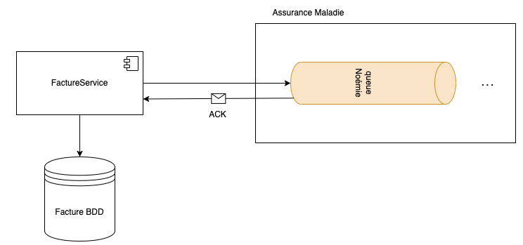

+++
draft = "true"
title = "Transactional outbox"
weight = 10
+++

> [!ressource] Ressources
> - [Pattern: Transactional outbox](https://microservices.io/patterns/data/transactional-outbox.html)
> - [Consistency in Microservices: Transactional Outbox Pattern](https://dip-mazumder.medium.com/consistency-in-microservices-transactional-outbox-pattern-bcd9d3b08676)

> [!danger] Définition
>   The Transactional Outbox pattern ensures atomicity by persisting events within the same transaction as the business logic

Dans certains systèmes :
- en plus de créer/mettre à jour l'information en base de données
- nous souhaitons publier un évènement

Par exemple, lors de la facturation dans un centre de soin :
- la facture est enregistrée en base de données
- mais également envoyée à la télétransmission Noémie
  - on peut supposer qu'un évènement est produit au travers d'un appel API Asynchrone
  - et nous devons nous assurer que la facture a bien été prise en compte par l'assurance maladie (ack SUCCESS) ou s'il y a eu un bug renvoyer la facture

## Problèmes
- S'il y a eu un problème dans la transaction pour enregistrer en base de données alors le message a quand même été produit dans la queue

- S'il y a un problème dans la queue alors il faut pouvoir être capable de renvoyer un évènement pour chaque facture n'ayant pas été correctement transmise

## Solution : Transactional outbox

> The Transactional Outbox Pattern addresses these issues by ensuring that message sending and database updates are coordinated within the same transaction.

Dans une même transaction :
- nous enregistrons la facture dans sa table
- et également un évènement dans une table `t_outbox` (e.g. `INSERT INTO outbox (event_type, payload, status, created_at)`)

Puis un processus ou un service distinct lit périodiquement la table `t_outbox` et tente d'envoyer les messages au système externe (e.g. une queue).

Après avoir envoyé le message et reçu l'ack, ce service tiers met à jour l'état de l'entrée de `t_outbox` pour indiquer qu'elle a été traitée (`status = SUCCESS`). En cas d'erreur dans la queue, nous n'aurons qu'à renvoyer l'ensemble des évènements n'ayant pas été marqués comme réussis, dans ce cas il faudra néanmoins faire attention aux doublons => Idempotence : 

> The Message relay might publish a message more than once. It might, for example, crash after publishing a message but before recording the fact that it has done so. When it restarts, it will then publish the message again. As a result, a message consumer must be idempotent, perhaps by tracking the IDs of the messages that it has already processed. Fortunately, since message Consumers usually need to be idempotent (because a message broker can deliver messages more than once) this is typically not a problem.

