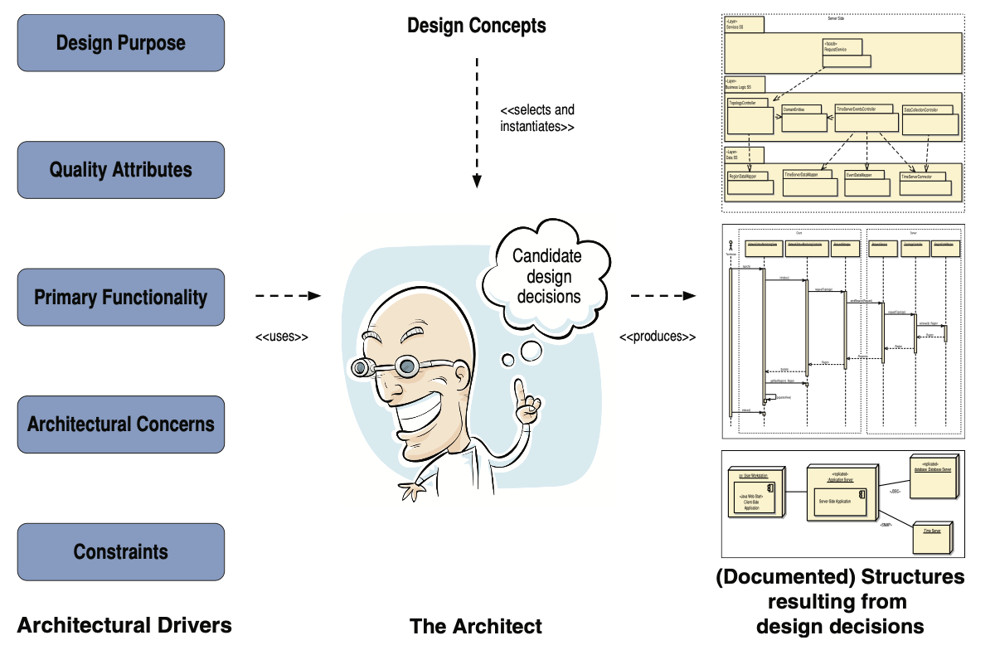

+++
draft = "true"
title = "Les rôles de l'architecte logiciel"
description = "Comprendre l'importance du rôle de l'architecte logiciel en développement informatique"
weight = 40
+++

> [!ressource] Ressources
> - [Software Engineer to Software Architect](https://medium.com/@yt-cloudwaydigital/from-software-developer-to-software-architect-roadmap-to-success-695951521d9)

## System Design

L'architecte logiciel est responsable de la conception de haut niveau du système logiciel. Il s'agit notamment de définir les composants du système et leurs interactions. Il prend des décisions en s'appuyant sur les besoins métiers (fonctionnels et non-fonctionnels) et sur les compétences de l'équipe de réalisation.  
L'architecte ne précise pas la technologie à utiliser (e.g. ReactJS), mais il précise qu'il faudra utiliser un framework _reactive-based_ pour la partie présentation

- Définir les [style architecturaux]({}) à utilser
- Identifier les [caractéristiques architecturales]({})

## Analyse continue de l'architecture

L'architecte doit garder un oeil sur les équipes de réalisation. Il doit s'assurer que les outils choisis et les développements effectués respectent bien les besoins. En effet, si l'architecte ne dévoue pas une partie de son temps à analyser l'architecture alors celle-ci pourrait avoir avoir un impact négatif sur les caractéristiques architecturales requises, telles que la baisse de la performance, de la disponibilité ou la difficulté à _scaler_.

## Expérience diversifiée

On ne lui demande pas d'être expert dans tous les domaines, mais l'architecte logiciel doit avoir des connaissances minimales dans plusieurs domaines informatiques (technologies, frameworks, plates-formes, et environnement). En effet, il doit être capable de sortir de sa zone de confort et de continuer à apprendre. Comprendre et suivre les tendances clés permet à l'architecte de se préparer aux futurs enjeux et de prendre une décision éclairée.

### Faire des compromis

L'architecte ne doit pas avoir un avis tranché (faire uniquement du microservice, uniquement sdu serverless, etc ...) mais doit continuellement comprendre le besoin afin de déterminer les **compromis** à effectuer pour répondre au besoin du client.

## Avoir des connaissances fonctionnelles

Il est primordial pour un architecte logiciel d'avoir des connaissances dans le domaine de l'entreprise. Comme pour le paragraphe précédent, on ne lui demande pas d'être un expert métier, mais il doit avoir un certain niveau de _business domain expertise_.

Ainsi en plus des compétences techniques, l'architecte devra évoluer fonctionnellement. Dans le cas contraire, il lui sera très difficile de comprendre les attentes et besoins métiers et d'y répondre de la plus juste des manières.

> Les architectes les plus performants sont ceux qui possèdent des connaissances pratiques/techniques étendues ainsi qu'une solide connaissance de leur domaine métier.

## Avoir des connaissances sur les non-requirement

Ce terme n'indique pas des choses qui ne sont pas requises, il se réfère plutôt à des exigences qui ne sont énoncées nulle part.
Cela inclut le contexte, les suppositions tacites, les dépendances cachées et d'autres choses qui n'ont jamais été explicitées.

On trouve la scalabilité, la maintenabilité, la disponibilité, l'interopérabilité, etc ...

Débusquer ces exigences implicites et les rendre explicites est l'une des contributions les plus précieuses de l'architecte.
