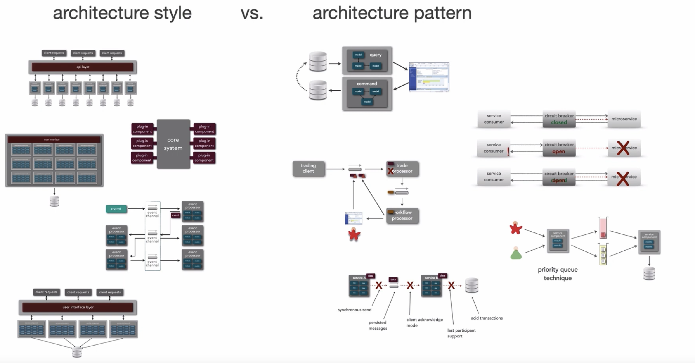

+++
draft = "true"
title = "Niveaux architecturaux"
weight = 30
+++

> [!ressource] Ressources
> - [Architecture Styles VS Architecture Patterns - Mark Richards](https://youtu.be/I-yBv72RCeA?t=30)  
> - [Architectural Styles vs. Architectural Patterns vs. Design Patterns](https://herbertograca.com/2017/07/28/architectural-styles-vs-architectural-patterns-vs-design-patterns/)

Tout est question de champ d'application :

- Un [style architectural]({}) est la conception de l'application au niveau d'abstraction le plus élevé ;
- Un [patron architectural]({}) est un moyen d'implémenter un style architectural ;
- Un [patron de conception]({}) est un moyen de résoudre un problème localisé.

Dans l'ensemble de ce cours nous nous concentrerons sur les [styles architecturaux]({}) tout en évoquant très brièvement les [patrons architecturaux]({}) mais nous ne reviendrons pas sur les [patrons de conception]({}). Nous reviendrons seulement sur certains concepts fondamentaux nécessaire pour comprendre les niveaux supérieurs.

## Styles vs Patterns
> How does microservices differ from CQRS ?

Nous reprenons les dires de Mark Richards 
|                                         Styles Architecturaux                                          |                                               Patrons Architecturaux                                                |
| :----------------------------------------------------------------------------------------------------: | :-----------------------------------------------------------------------------------------------------------------: |
|                        Forment l’architecture globale de l’ensemble du Système                         | Peut-être utilisé à avec n’importe quel style  architectural; ils permettent de résoudre un problème en particulier |
| Va influencer des aspects de la structure du Système (e.g. la communication, granularité des services) |                                Ne va pas influencer la structure globale du Système                                 |  |

Par exemple la patron *circuit breaker* peut être mis en oeuvre avec n'importe quel style architectural
