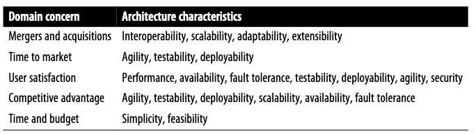

+++
draft = "true"
title = "Définition"
weight = 1
+++

> [!danger] Définition
>  Toutes les choses que le logiciel doit faire et qui ne sont pas directement liées à la fonctionnalité métier.

Le terme *Caractéristiques Architecturales* englobe les notions de :
- [Critères non-fonctionnel](https://en.wikipedia.org/wiki/Non-functional_requirement)
- [Quality attributes](https://en.wikipedia.org/wiki/List_of_system_quality_attributes)

Il n'existe pas une liste standart, néanmoins l'ISO à publié une [liste organisée par catérogie](https://iso25000.com/index.php/en/iso-25000-standards/iso-25010) 

Un logiciel ne peut pas appliquer toutes ses caractérisiques, il faudra faire des compromis :
- Chaque caractéristiqueque demande des efforts
- Chaque caractéristique architecturale peut en impacter une autre. Augmenter la *Sécurité* fera diminuer la *Performance* du système.

Il faudra alors prendre le temps d'identifier les caractéristique architecturale important du métier

## Le rôle de l'architecte
On observe également une distinction entre l'Architecture et le Design. Notamment le rôle des architectes dans la définition des caractéristiques architecturales, les aspects importants du système indépendamment du domaine. 

L'architecte logiciel devra découvrir et analyser toutes les choses que le logiciel doit faire et qui ne sont pas directement liées à la fonctionnalité métier : les caractéristiques architecturales.
